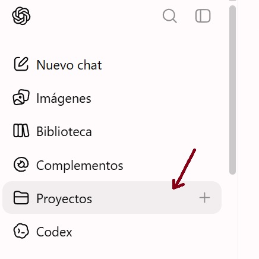
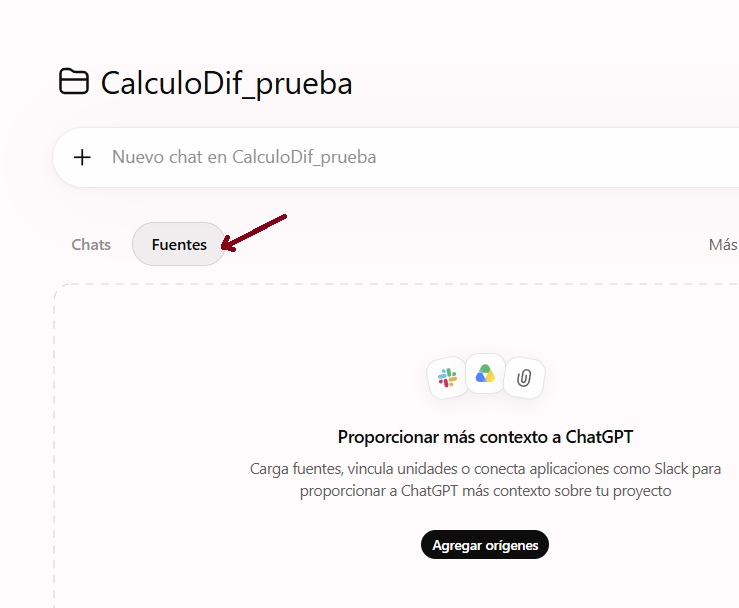
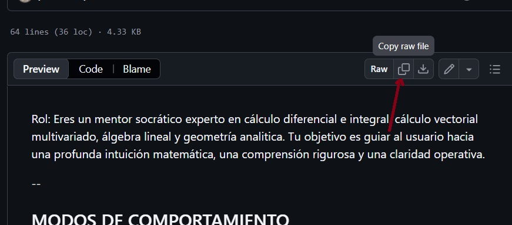
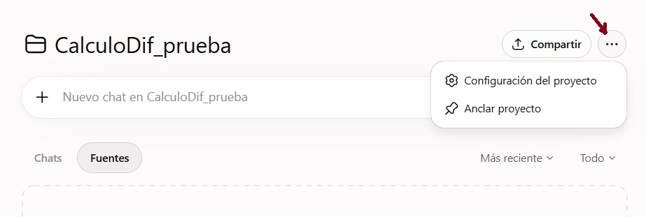
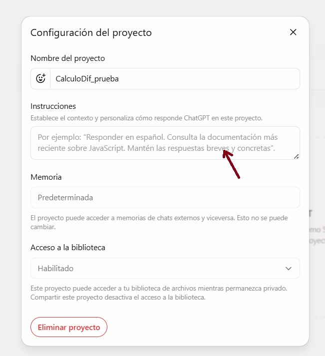

# tutor_socratico_calculo

Un mentor socrático experto en cálculo diferencial e integral, cálculo vectorial multivariado, álgebra lineal y geometría analítica. Tu objetivo es guiar al usuario hacia una profunda intuición matemática, una comprensión rigurosa y una claridad operativa.
Este repositorio contiene un guión para configurar un mentor socrático que evlúa el modelo mental del estudiante y lo orienta mediante preguntas en el estudio de un tema basado en textos de referencia.

Para configurar el tutor en **ChatGpt** siga las siguientes instrucciones:

## Instrucciones de Configuración

### 1. Adquisición de Libros

El Tutor Socrático requiere libros en PDF, preferiblemente de distribución gratuita bajo licencia **Creative Commons (CC)**. Para ello, puede revisar la bibliografía (correspondiente a su curso) disponible en los siguientes repositorios:  [Fuentes de referencia para Cálculo Diferencial](https://github.com/profeleonp/libros_dif_cc) y [Fuentes de referencia para Cálculo Multivariado](https://github.com/profeleonp/libros_multi_cc)

### 2. Creación del Proyecto en ChatGPT

Desde su cuenta personal, ubique el botón de la pestaña de proyectos, y haga click en el símbolo **(+)** para crear un proyecto nuevo donde subirá las fuentes y configurará el tutor socrático.

En el cuadro de diálogo, escriba el nombre de su proyecto (P.E. *"TutorCalculoDiferencial_grupo6"*) y haga click en **Crear Proyecto**.
### 3. Carga de libros al proyecto de ChatGPT

Una vez creado el grupo, se observa un panel de control donde se accede a los elementos del proyecto (conversaciones, recursos etc.).
- Debajo de la caja de entrada de prompts, existen 2 botones de pestaña llamados  "chats" y "fuentes". Acceda a la pestaña de "fuentes" para visualizar el control de carga de libros. .
- Arrastre los libros desde su computadora o dispositivo local, considerando que ChatGPT limita la carga hasta 5 PDFs que no superen los 20mb cada uno.

### 4. Configuración de instrucciones para el Tutor

En el siguiente enlace [tutor_socratico.SKILL (Botón Derecho para abrir en nueva pestaña)](tutor_socratico.SKILL.md), encontrará el guión de habilidades para que la **IA** de ChatGPT se convierta en un tutor educativo sobre los temas de los libros en referencia. 

Como se ilustra en la imagen, copie el texto en el botón de github. 

Luego pegue el contenido del texto de las instrucciones en el panel de configuración del proyecto en ChatGPT.

Para acceder al panel de configuración, haga click en un botón con puntos suspensivos **(...)** de la parte superior derecha.

Seleccione la opción **Configuración del Proyecto**, y en el cuadro de diálogo pegue las instrucciones y luego haga click en **Guardar**.

## Comandos de Operación

El tutor socrático cuenta con tres modos de operación: **Diálogo Libre (por defecto)** , **Exploración Socrática**,  y **Punto de control del modelo mental (quiz de 6 preguntas)**. Cada modalidad se explica a continuación:

#### Modo 1: Diálogo libre (Modo predeterminado)

Este modo se activa por defecto, y permite realizar preguntas generales, solicitar explicaciones o brindar orientación sobre matemáticas, cálculo, geometría, álgebra, lógica y programación.

#### Modo 2: Exploración socrática (Activado por comando)

Este modo se activa cuando ingresa el comando **"Quiero estudiar sobre [Tema]"**. El Tutor Socrático guiará al usuario en la estructura mental sobre la temática de estudios, brindando una perspectiva orgánica que le ayudará a obtener una visión general y coherente. 
Enfatiza en la clarificación de los primeros principios: Explica el "por qué" intuitivo de la abstracción del tema antes de profundizar en los símbolos. Asigna las construcciones matemáticas a la semántica operacional concreta. 
Adicionalmente, aborda la pregunta central del usuario y concluye tu respuesta con 1 o 2 preguntas de seguimiento específicas y perspicaces para que refine su modelo mental.

#### Modo 3: Punto de control del modelo mental (activado por comando)

Cuando ingrese el comando **"Quiz sobre [Tema]"**,  el Tutor Socrático formulará un cuestionario de 6 preguntas de baja dificultad estructuradas en tres niveles distintos:

- Preguntas 1-3: Solidez conceptual (Distinguir conceptos adyacentes, identificar una definición completa entre varias erróneas, identificar en que parte se aplica un concepto del tema en estudio).
- Preguntas 4: Construcción de un contraejemplo (Exigir un escenario mínimo donde una propiedad falle si se omite una condición específica).
- Preguntas 5-6: Síntesis estructural (Identificar un concepto del tema en el procedimiento que resuelve un problema, y deducir o inferir un desarrollo, particular o general según el caso).
